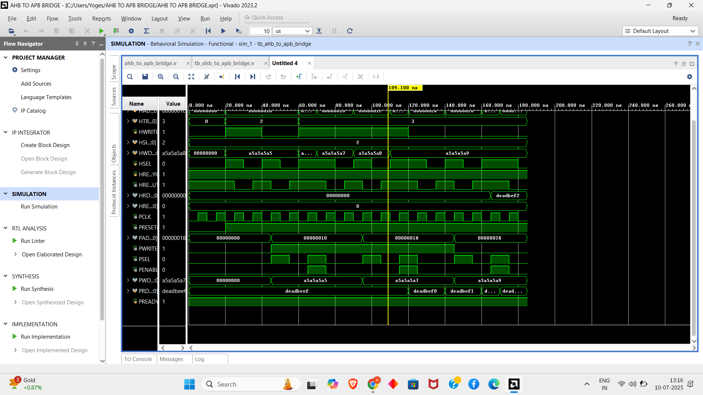
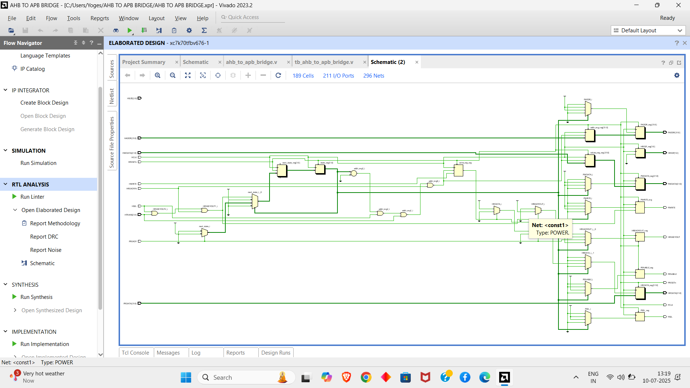

# AHB to APB Bridge

## Overview

This project implements a synthesizable AHB to APB Bridge using Verilog, designed to interface the high-performance Advanced High-performance Bus (AHB) with the low-power Advanced Peripheral Bus (APB) as per the AMBA specification. The bridge facilitates seamless data transfers between AHB masters and APB slaves, supporting single read/write operations, burst write transfers, and timeout handling. The design is verified through a comprehensive testbench that includes four test cases: single write, single read, burst write, and timeout handling.

## About the AMBA Buses

The Advanced Microcontroller Bus Architecture (AMBA) is an on-chip communication standard for high-performance embedded systems. It defines three primary buses:

- **Advanced High-performance Bus (AHB)**: A high-performance backbone bus for connecting processors, on-chip memories, and external memory interfaces with high clock frequencies.
- **Advanced System Bus (ASB)**: An alternative high-performance bus for systems not requiring AHB's advanced features.
- **Advanced Peripheral Bus (APB)**: A low-power bus optimized for minimal power consumption and reduced interface complexity, ideal for peripheral devices.

The AHB to APB Bridge serves as an interface between the AHB (system bus) and APB (peripheral bus), as shown below:


## Basic Terminology

- **Bus Cycle**: A single clock period, defined from rising edge to rising edge for AHB and APB protocols.
- **Bus Transfer**: A read or write operation of a data object. AHB transfers may span multiple cycles, while APB transfers require exactly two cycles (setup and access).
- **Burst Operation**: Multiple data transactions initiated by an AHB master to an incremental address region. APB does not support bursts.

## AMBA Signals

### AMBA AHB Signals

| Name        | Source          | Description                                                                 |
|-------------|-----------------|-----------------------------------------------------------------------------|
| HCLK        | Clock source    | Times all AHB bus transfers, synchronized to the rising edge (100 MHz).     |
| HRESETn     | Reset controller| Active-low reset signal for the AHB system and bus.                         |
| HADDR[31:0] | Master          | 32-bit system address bus driven by the AHB master.                         |
| HTRANS[1:0] | Master          | Transfer type: NONSEQ (10), SEQ (11), IDLE (00), BUSY (01).                |
| HWRITE      | Master          | High for write transfers, low for read transfers.                           |
| HWDATA[31:0]| Master          | 32-bit write data bus from AHB master to slave.                             |
| HSELx       | Decoder         | Slave select signal, indicating the bridge is selected for a transfer.       |
| HRDATA[31:0]| Slave           | 32-bit read data bus from the bridge to the AHB master.                     |
| HREADY      | Slave           | High when transfer is complete; low to extend transfer.                     |

### AMBA APB Signals

| Name         | Source           | Description                                                                 |
|--------------|------------------|-----------------------------------------------------------------------------|
| PCLK         | Clock Source     | Times all APB transfers, synchronized to the rising edge (50 MHz).          |
| PRESETn      | Reset Controller | Active-low reset signal for the APB bus.                                    |
| PADDR[31:0]  | Master           | 32-bit APB address bus driven by the bridge.                                |
| PSELx        | Master           | Select signal for the APB slave, indicating a transfer is required.          |
| PENABLE      | Master           | Strobe signal indicating the second (access) cycle of an APB transfer.      |
| PWRITE       | Master           | High for write access, low for read access.                                 |
| PRDATA[31:0] | Slave            | 32-bit read data bus driven by the APB slave during read cycles.            |
| PWDATA[31:0] | Master           | 32-bit write data bus driven by the bridge during write cycles.             |

## Implementation

### Objective

Design and simulate a synthesizable AHB to APB Bridge in Verilog, capable of:
- Converting AHB transfers (single read/write, burst write) to APB transfers.
- Latching and holding addresses throughout transfers.
- Decoding addresses to generate peripheral select signals (`PSELx`).
- Driving data between AHB and APB for read and write operations.
- Generating timing strobes (`PENABLE`) for APB transfers.
- Handling timeouts to prevent bus stalls.

The bridge interface is illustrated below:


### Basic Implementation Tools

- **HDL**: Verilog
- **Simulator Tool**: Xilinx Vivado 2023.2
- **Synthesis Tool**: Xilinx Vivado 2023.2
- **Target Device**: Xilinx Artix-7 (e.g., XC7A35T-CPG236-1)
- **Testbench**: AHB Master and APB Slave models for simulation

### Design Modules

#### AHB Slave Interface
- Responds to AHB transfers initiated by the master, using `HSELx` to detect relevant transfers.
- Captures `HADDR`, `HWRITE`, `HTRANS`, and `HWDATA` to initiate APB transactions.
- Drives `HRDATA` and `HREADY` to complete AHB transfers.

#### APB Controller
- Implements a finite state machine (FSM) to control APB signals (`PADDR`, `PSELx`, `PENABLE`, `PWRITE`, `PWDATA`).
- Decodes AHB addresses to select APB peripherals.
- Synchronizes AHB (100 MHz) and APB (50 MHz) clock domains for reliable transfers.

### FSM Description

The bridge uses an 8-state FSM to manage AHB to APB transfers. The states, their purposes, key actions, entry points, and transitions are detailed below:

| State       | Description                          | Purpose                                    | Key Actions                                              | Entry From                      | Next State                        |
|-------------|--------------------------------------|--------------------------------------------|----------------------------------------------------------|---------------------------------|-----------------------------------|
| ST_IDLE     | Default state, no transfer           | Hold last APB values, Pselx and Penable low| Reset APB signals, wait for valid AHB transfer           | Reset, ST_RENABLE, ST_WENABLE   | ST_READ, ST_WWAIT                 |
| ST_READ     | Initiate APB read transfer           | Start read transaction                     | Decode Haddr to Paddr, Pselx high, Pwrite low            | ST_IDLE, ST_RENABLE, ST_WENABLE | ST_RENABLE                        |
| ST_RENABLE  | Enable APB read transfer             | Complete read transaction                  | Penable high, latch Prdata to Hrdata                     | ST_READ                         | ST_IDLE, ST_READ, ST_WWAIT        |
| ST_WWAIT    | Wait for AHB write data              | Synchronize AHB write data                 | Latch Hwdata, delay for synchronization                  | ST_IDLE, ST_RENABLE, ST_WENABLE | ST_WRITE                          |
| ST_WRITE    | Initiate single APB write transfer   | Start single write transaction             | Decode Haddr to Paddr, Pselx and Pwrite high, Hwdata to Pwdata | ST_WWAIT, ST_IDLE, ST_WENABLEP | ST_WENABLE, ST_WENABLEP           |
| ST_WENABLE  | Enable single APB write transfer     | Complete single write transaction          | Penable high, latch Pwdata to peripheral                 | ST_WRITE, ST_WRITEP             | ST_IDLE, ST_READ, ST_WWAIT        |
| ST_WRITEP   | Initiate burst APB write transfer    | Start burst write transaction              | Decode Haddr to Paddr, Pselx and Pwrite high, Hwdata to Pwdata | ST_WWAIT, ST_WENABLEP          | ST_WENABLEP, ST_WENABLE           |
| ST_WENABLEP | Enable burst APB write transfer      | Complete burst write transaction           | Penable high, latch Pwdata to peripheral                 | ST_WRITEP                       | ST_WRITEP, ST_WENABLE, ST_IDLE    |

## Simulation Results



**Schematic**:




Waveform results (generated in Vivado) confirm correct AHB to APB signal mappings for all test cases.

## Synthesis Results

- **RTL Model**: The synthesized design includes registers for address/data latching and an FSM controller, optimized for the Artix-7 FPGA.
- **Resource Utilization**: Minimal LUTs and FFs, suitable for low-power applications.
- **Timing Analysis**: Meets timing constraints at 100 MHz (`Hclk`) and 50 MHz (`Pclk`).

## Notes

- The AHB Master and APB Slave in the testbench are for simulation only; the bridge is synthesizable.
- The design assumes synchronous clocks (`Pclk` derived from `Hclk`).
- The project directory should avoid spaces (e.g., use `C:/Users/Yoges/AHB_to_APB_Bridge/`).

## Further Work

- Add support for `PREADY` to handle variable-latency APB slaves.
- Implement burst read operations on the AHB side.
- Include arbitration for multiple AHB masters.
- Enhance testbench with random address/data patterns and error injection.

## Documentation

- AMBA Specification: [AMBA Specifications.pdf](https://github.com/prajwalgekkouga/AHB-to-APB-Bridge/files/9731507/AMBA.Specifications.pdf)
- AMBA Modules: [AMBA Modules.pdf](https://github.com/prajwalgekkouga/AHB-to-APB-Bridge/files/9731505/AMBA.Modules.pdf)
- Vivado User Guide: [UG900](https://www.xilinx.com/support/documentation/sw_manuals/xilinx2023_2/ug900-vivado-logic-simulation.pdf)


## 🛠️ Developer Workspace

For users working with **VS Code** or **GitCode’s web IDE**, you can open the pre-configured workspace file to instantly load the project structure and folders:

```bash
ahb_to_apb_bridge.code-workspace


```